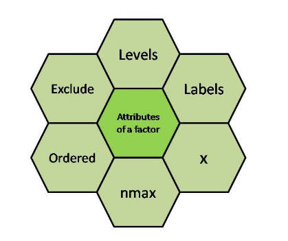
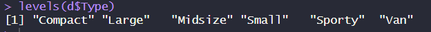
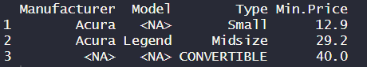
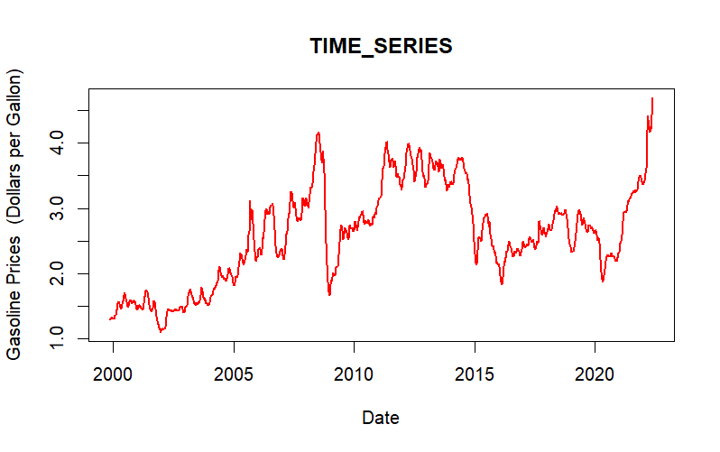
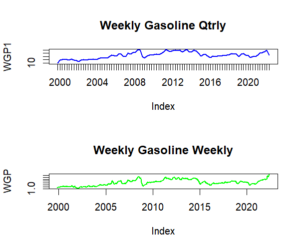
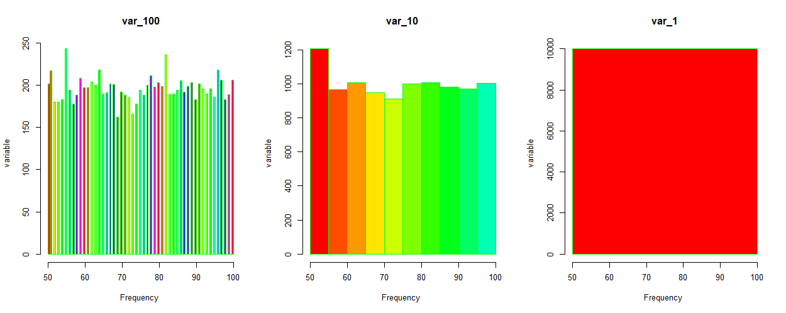

DATA HANDELING and DATA CLEANING

**Functions:**

colnames(data) –\> to list down the names of all columns

is.nan(X) –\> gives boolean value of weather func is NAN or not.

is.infinite(X) –\> gives boolean value of weather func returns infinite value or not.

complete.cases –\> to select all the cases except NA and NANe.g. ``` subset(DF, complete.cases(DF)) /``na.omit(DF) ```

`median(Freedman$density)` –\> can't calc median because it has NA observation

`median(Freedman$density , na.rm=T`) –\> compute the median of the density ignoring any NA values

`Freedman.good=na.omit(Freedman)` –\> gives the drastic treatment removes full row which have NA observation

\*\*carefully decide weather to use `na.omit` or not

`rbind.data.frame` –\> combine 2 or more dataframes by row

$Factors in R programming$

Data structures that are implemented to categorize the data and store it on multiple levels

{width="296"}

-   **x:** It is the vector that needs to be converted into a factor.

-   **Levels:** It is a set of distinct values which are given to the input vector x.

-   **Labels:** It is a character vector corresponding to the number of labels.

-   **Exclude:** This will mention all the values you want to exclude.

-   **Ordered:** This logical attribute decides whether the levels are ordered.

-   **nmax:** It will decide the upper limit for the maximum number of levels.

\$\$To change the factor variables \$

YOU CAN ONLY CHANGE THE VALUES OF `NA` values

STEP1 : Find out the existing levels by

> levels(d\$Type) here d is dataframe and Type is the column we have to know the level

{width="390" height="29"}

STEP2 : Drop the existing levels by

> d\$Type=droplevels(dType)

STEP3 : Specifying new levels

> levels(d$Type) = c(levels(d$Type), c("LARGE" , "SMALL" , "FINE" , "CONVERTIBLE", "SLEAK"))

STEP4 : Add the levels in the same column

> d[3, c(3)]=list("CONVERTIBLE" )

{width="313"}

ADDING A NEW ROWS

1.  Manually
2.  Using `rbind` \> `d=rbind(d, list("Audi", "A4" , "SLEAK" , "41.2"))`

CREATING A NEW COLUMN

1.  Manually
2.  using `within` \> `d = within(d, {MODPRICE= Min.Price*1.3})`
3.  Adding columns in a dataframe can be done by `cbind`

CHANGING THE DATA TYPE

1.  **To Numeric**: `as.numeric()`
2.  **To Factor**: `as.factor()`
3.  **To Date**: `as.Date()`
4.  **To Logical**: `as.logical()`
5.  **To Integer**: `as.integer()`

DATA VISUALIZATION

{width="500"}

We can compare two graphs together by : `mfrow` command i.e. **"multiple figures by row"** which is used inside the `par()` function.

> par(mfrow=c(2,1))

{width="500"}

get the histogram done

`var= sample(50:100 , 10000, replace =T)`

`par(mfrow=c(1,3))` used to plot graphs side by side

`hist(var,main= "var_100" ,xlab = "Frequency " , ylab = "variable ", col=rainbow(20) , border="green" , breaks=100)`

`hist(var, main= "var_10", xlab = "Frequency " , ylab = "variable ", col=rainbow(20) , border="green" , breaks=10)`

`hist(var,main= "var_1",xlab = "Frequency " , ylab = "variable ", col=rainbow(20) , border="green" , breaks=1)`

`par(new=T)` \# allows you to add a new plot on top of the existing one

`par(mar=c(5,5,5,5)+1)` setting the margins
